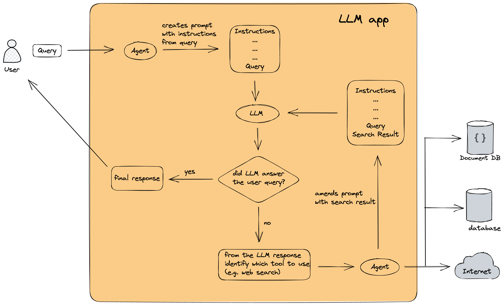

# langchain-blog
An accompanying repository for my [blog post about LangChain](https://medium.com/mlearning-ai/supercharging-large-language-models-with-langchain-1cac3c103b52).

To run this [MRKL](https://arxiv.org/abs/2205.00445) application install the requirements (`pip3 install -r requirements.txt`)) and run `python3 mrkl_app.py` (tested on Python 3.9.6).

This application performs multi-step Retrieval Augmented Generation (RAG) until the final response can be given by the LLM. Tested with OpenAI models (GPT-3.5 and GPT-4).

To see the intermediate steps the MRKL agent is taking to arrive at the final answer set `verbose=True` when initialising the agent.

## Flow diagram

